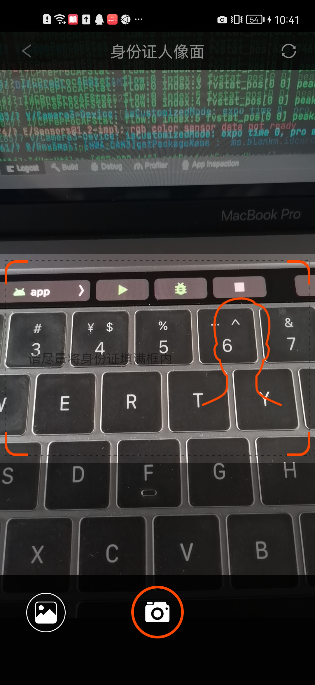
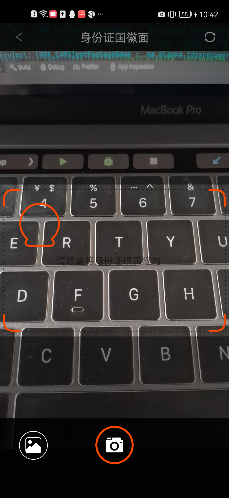

### 身份证拍照Lib使用文档

身份证正反面连续拍摄、权限申请判断，支持单独拍摄正反类型、自动裁剪、放大、缩小、摄像头自动对焦、支持相册选择图片等功能，链式调用简洁操作


  


### 功能特点

- 自定义相机界面
- 支持手动触摸屏幕对焦
- 支持自动对焦
- 支持图片自动裁剪
- 支持图片手动不规则裁剪
- 支持AndroidQ


### 初始化

#### Step 1. 添加 JitPack 仓库

在项目的 build.gradle 添加 JitPack 仓库

```	grade
   allprojects {
		repositories {
			...
			maven { url 'https://jitpack.io' }
		}
   }
```

#### Step 2. 添加依赖

在需要使用的 module 中添加依赖

``` gradle
   dependencies {
        implementation 'com.github.Blankyn:IDCardCamera:1.0.0'//请使用最新版本
        implementation 'androidx.appcompat:appcompat:1.3.1'//目前仅支持AndroidX
   }
```

#### Step 3. 打开拍照界面or相册选择

- 身份证正面

```java
IDCardCameraSelect.create(this).openCamera(IDCardCameraSelect.TYPE_IDCARD_FRONT);
```

- 身份证反面

```java
IDCardCameraSelect.create(this).openCamera(IDCardCameraSelect.TYPE_IDCARD_BACK);
```

- 身份证正/反面

```java
IDCardCameraSelect.create(this).openCamera(IDCardCameraSelect.TYPE_IDCARD_All);
```

**注意：** create() 方法的参数传的是上下文，在 Activity 中传 activity.this，在 Fragment 中传 fragment.this

- 相册选择

> 由于【相册选择】图片时可能存在不规则的图片以及不知道身份证在图片中的具体位置, 为了减少>   噪声干扰，提高识别正确率避免用户二次选择操作，因此默认对图片做以下操作：
> 1. 裁剪功能；
> 2. 移动功能；
> 3. 放大功能；
> 4. 缩小功能；


#### Step 4 返回的结果

```java

@Override
protected void onActivityResult(int requestCode, int resultCode, @Nullable Intent data) {
        super.onActivityResult(requestCode, resultCode, data);
        if (resultCode == IDCardCameraSelect.RESULT_CODE) {
            List<String> path = IDCardCameraSelect.getImagePath(data);
            if (path != null && path.size() > 0) {
            	//解析path返回bitmap，则可回调到UI层显示Bitmap
                Bitmap bitmap = BitmapFactory.decodeFile(path.get(0 / 1));
    	}
	}
}
```


### 清除缓存

实际开发中将图片上传到服务器成功后需要删除全部缓存图片，调用如下方法即可：

```java
* 建议在页面销毁时处理
FileUtils.clearCache(getApplicationContext());
```


### License

```xml
  Copyright 2021, blankm

   Licensed under the Apache License, Version 2.0 (the "License");
   you may not use this file except in compliance with the License.
   You may obtain a copy of the License at

       http://www.apache.org/licenses/LICENSE-2.0

   Unless required by applicable law or agreed to in writing, software
   distributed under the License is distributed on an "AS IS" BASIS,
   WITHOUT WARRANTIES OR CONDITIONS OF ANY KIND, either express or implied.
   See the License for the specific language governing permissions and
   limitations under the License.
```


